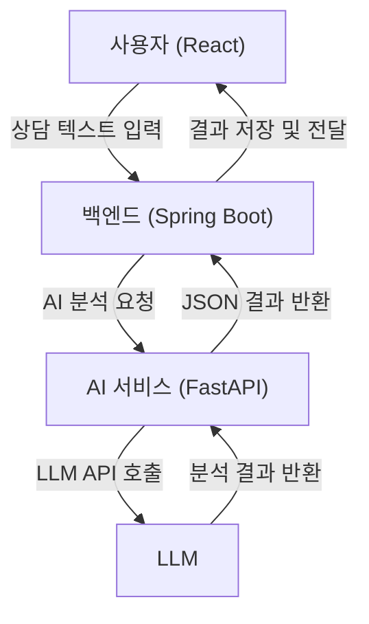

# 상담 내용 AI 분석 및 관리 시스템

## 1. 프로젝트 목표
관리자가 입력하는 고객 상담 텍스트(STT 변환 결과, 채팅 로그 등)를 AI를 통해 분석하고, 업무에 필요한 인사이트를 제공하는 웹 애플리케이션을 개발합니다. 이를 통해 상담 품질을 향상시키고 관리 업무의 효율을 극대화하는 것을 목표로 합니다.

## 2. 주요 기능
- **상담 내용 요약:** 긴 상담 내용의 핵심을 파악할 수 있는 요약문을 생성합니다.
- **핵심 키워드 태깅:** 상담의 주요 이슈(예: "카드 발급", "대출 문의", "고객 불만")를 자동으로 태깅합니다.
- **감정 분석:** 고객의 감정 상태(긍정, 부정, 중립 등)를 분석하여 대응 전략 수립을 돕습니다.
- **리스크 분석:** 향후 민원 발생 가능성이나 고객 이탈 확률과 같은 리스크를 예측하여 점수화합니다.
- **분석 결과 조회:** 과거에 분석한 상담 내용과 AI의 분석 결과를 목록으로 확인하고 관리합니다.
- **민감 정보 관리:** 민감한 정보(개인정보 등) 을 마스킹 및 인코딩해서 관리

## 3. 개발 기술 스택
본 프로젝트는 각 기능별 전문성에 맞춰 역할이 분리된 마이크로서비스 아키텍처(MSA)를 따릅니다.

- **프론트엔드 (Frontend):**
  - `React`
  - `TypeScript`
  - `Axios` (for HTTP communication)

- **백엔드 (Backend):**
  - `Java 17`
  - `Spring Boot 3.x`
  - `Spring Data JPA`
  - `mySQL` (Database)

- **AI 서비스 (AI Service):**
  - `Python 3.11`
  - `FastAPI`
  - 외부 LLM API (e.g., Google Gemini, OpenAI GPT)

## 4. Workflow (데이터 처리 흐름)

## 5. 개발 계획
프로젝트는 각 서비스의 의존성을 고려하여 다음 순서로 진행합니다.

1.  **AI 서비스 개발 (FastAPI)**
    - 텍스트를 입력받아 LLM으로 분석 후 JSON을 반환하는 API를 구현합니다.
2.  **백엔드 서버 개발 (Spring Boot)**
    - AI 서비스 API를 호출하고, DB에 결과를 저장하며, 프론트엔드에 데이터를 제공하는 API를 구현합니다.
3.  **프론트엔드 개발 (React)**
    - 사용자가 텍스트를 입력하고, 백엔드 API를 호출하여 결과를 화면에 표시하는 UI를 개발합니다.
4.  **통합 및 테스트**
    - 전체 시스템을 연동하고 최종 테스트를 진행합니다.
